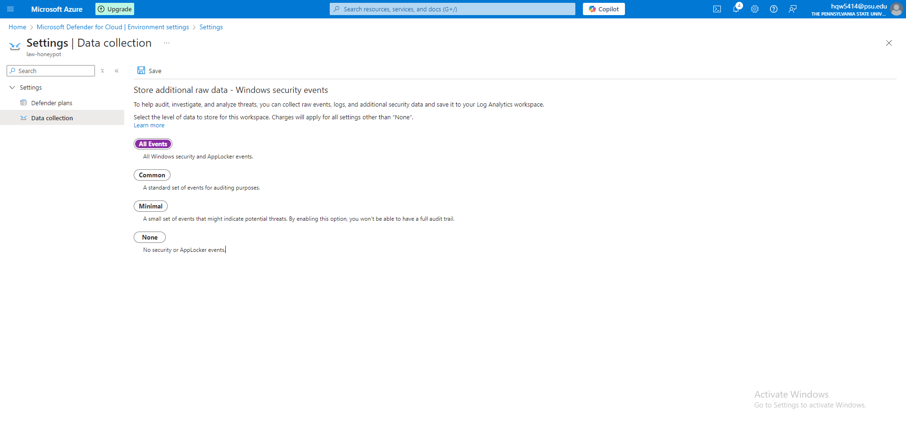

# Home Lab: Azure VM Exposed to Global Attacks

---

This project provides a comprehensive walkthrough of using Microsoft Azure to deploy a Windows 10 virtual machine (VM) in the cloud, configured for internet accessibility. The setup employs Azure Log Analytics Workspace, Microsoft Defender for Cloud, and Microsoft Sentinel to collect, aggregate, and visualize security-related data. Specifically, PowerShell is used to monitor Event Viewer on the exposed VM, focusing on EventID 4625, which tracks failed logon attempts. This log data is directed to a logfile, and the PowerShell script sends the IP addresses of failed logons to IPgeolocation.io via an API. The geolocation data is then utilized in Microsoft Sentinel to map the origins of these login attempts, enhancing security visibility. This project illustrates effective use of Azure’s cloud security and monitoring tools for real-time threat detection and analysis.

---

## Table of Contents
- [About the Project](#about-the-project)
- [Tools and Environments Used](#tools-and-environments-used) 
- [Architecture Overview](#architecture-overview)
- [Lab Setup](#lab-setup)
- [Usage](#usage)
- [License](#license)
- [Contact](#contact)

---

## About the Project

This home lab allows us to simulate real-world attacks on a deliberately exposed Azure Virtual Machine (VM) by setting up a vulnerable environment. The purpose is to study attack patterns, gather threat intelligence, and gain hands-on experience with cybersecurity monitoring tools like Azure Log Analytics and a SIEM platform. 

We intentionally expose the VM to the internet and track the malicious activities using the following:
- Azure Log Analytics Workspace to capture logs.
- A Security Information and Event Management (SIEM) tool to correlate, visualize, and alert on attack patterns.
  
The data collected is used for forensic analysis, intrusion detection, and crafting better defensive mechanisms.

---

## Tools and Environments Used

- **Microsoft Azure**: Cloud platform for hosting and managing resources.
  - **Azure Virtual Machines**: Windows 10 VM deployed as a monitored target.
  - **Azure Log Analytics Workspace**: Centralized tool for log collection and data analysis.
  - **Microsoft Defender for Cloud**: Advanced threat protection and security insights.
  - **Microsoft Sentinel**: SIEM (Security Information and Event Management) tool for aggregating and visualizing security events.

- **PowerShell**: Scripting language used for automation, particularly for monitoring Event Viewer on the VM and logging failed login attempts.

- **IPgeolocation API** (via [IPgeolocation.io](https://ipgeolocation.io/)): API to fetch geolocation data based on IP addresses, enabling mapping of login attempt origins in Microsoft Sentinel.

- **Windows Event Viewer**: Integrated tool on Windows 10 VM used for system and security event logging, with a focus on EventID 4625 for tracking failed login attempts.

---

## Architecture Overview

The architecture consists of the following components:
1. **Azure VM**: A virtual machine running Ubuntu, exposed to the internet via a public IP, with minimal security to invite potential attacks.
2. **Log Analytics Workspace**: An Azure service used to collect, analyze, and monitor log data from the VM.
3. **SIEM Tool (Azure Sentinel or another third-party solution)**: Integrated with Log Analytics Workspace to track and correlate security events.
4. **Attack Traffic**: Traffic from global attackers targeting the open VM.

|  |
|:------------------------------:|

---

## Lab Setup

### Prerequisites:
- An active [Microsoft Azure](https://azure.microsoft.com) account.
  - Sign up for an Azure to get $200 in free credit
- Windows Machine (This project is tailored towards Windows OS).
  - PowerShell installed on the device

### Steps:

| **Azure Portal** |
|:----------------:|
| After creating an Azure account, open the Azure Portal |

| **Create Azure VM** |
|:----------------:|
| Create a new resource group (names do not matter), fill in vm name, select a region (West US 2 works for me) & size (Not seen in screenshot but the option is above **Adminstrator Account**, you can choose a bigger suze to ensure a better VM performance), create a new admin account, then make sure that **Public Inbound Ports** are set to "Allow Selected Ports" and the Selected ports to be "RDP (3349)" |

| Click next on all tabs until you reach the **Networking** tab. Here you will set **NIC network security group** to "Advanced" and configure a new network security group. From the "Create network security group" page, delete any default inbound rules and create a new rule that allows all traffic to pass through with the wildcard "*" and lowered **Priority**. Click "Save" and return to the "Create a Virtual Machine" page then proceed to create the VM. |

| **Log Analytics Workspace** |
|:----------------:|
| Search for "Log Analytics Workspace" in the search bar |

| **Create a Log Analytics Workspace** |
|:----------------:|
| Create a new LAW. Select the right resource group, name, and region then click through until you create the new Log Analytics Workspace. |

| **Microsoft Defender for Cloud** |
|:----------------:|
| Search for "Microsoft Defender for Cloud" in the search bar. Once you arrive on the page, look for **Environment settings** on the left-hand side then find & click on your LAW that you created earlier (in my case it would be "law-honeypot"). In the **Defender plans** settings, make sure that everything but "SQL servers on machines" is turned on and then click on the **Data collection** option on the left. For this, make sure it is set to "All Events" and then exit the page. |

| **Connect Sentinel to VM** |
|:----------------:|
| Now, go back to Log Analytics Workspace and find the "Virtual machines (deprecated)" option and click your VM to connect it. Then, travel to the "Microsoft Sentinel" page, click to create a new Sentinel resource and then connect to your workplace.  |

| **Start and Connect to your VM** |
|:----------------:|
| Traverse to the Virtual machines section and open Remote Desktop Connection on your native PC. On the VM information page, find & copy the public IP address of your VM and paste it into Remote Desktop. Once prompted to login, enter the credentials of the admin account you create earlier.|

| **Start VM and Event Viewer** |
|:----------------:|
| Once logged in (you can choose no for all privacy settings and skip through the rest), search for Event Viewer on your VM. Event Viewer allows you to see event logs that have actions identified by their EventID. Opening Event Viewer, go to Windows Logs -> Security to see any security event logs. You can try to open another Remote Desktop tab and purposely enter wrong credentials to see if a new security log with ID 4625, meaning failed login attempt, will show up. |

| **Expose VM** |
|:----------------:|
| In order to let all attackers in, we need to disable the firewall of the VM. Go to Windows Defender Firewall, click blue properties button under the listed profiles, and then for the Domain, Private, and Public profiles, turn firewall state off. To check if the changes were applied, go to back to your native PC, open terminal, and then using the ping command 'ping 20.120.177.152 -t' (change the ip address to your VM's public ip). If the VM sends an ICMP echo reply then it means that it works. |

| **API Key and Script** |
|:----------------:|
| Now, go to ipgeolocation.io on your native PC, sign up if you haven't already, then get your api key. Going back to the VM, open Powershell ISE and insert the script provided in this repo either by downloading it or copy & pasting it. In the "$API_KEY" line replace the key with yours that you got from the website. Once you are finished pasting the key, save the file and then run the script. Any failed login attempts will be in purple text in the terminal below the script and should be logged in the file "failed_rdp". |

| **Bring failed_log into LAWs** |
|:----------------:|
| We want to bring the log of failed attempts into Log Analytics Workspace. Navigate to your LAW, find the "Tables" dropdown, and then click "Create" -> "New custom log (MMA-based)". The next step is the Sample. This is where we enter the failed_log data to train LAW. Open Notepad on your native PC, copy the contents of the log file from your VM & paste it into the new Notepad, save it, and enter the file as the sample. Proceed until you reach "Collection Paths" and enter the path file of the original failed_log file in the VM. Finish and create the new log (this step may take some time). |

| **Workbook Creation + World Map** |
|:----------------:|
| On this step, you can create custom fields that can be used for extracting specific information and tailored insights. In this case, extracting custom fields for your world map will create a more advanced, customizable, and and other benefits but we will skip this step. You can find instructions for doing this in other SIEM lab tutorials. To create a worldmap, go to Microsoft Sentinel -> Workbooks -> Add Workbook. Then Add -> Add Query, add the query labeled "KQL_Query" in this repo into the work space, adjust the map settings, and then run it. You should see the indicators where attackers are trying to attempt RDP brute force attacks from.  |

| **Conclusion** |
|:----------------:|
| That about wraps up the lab. After finishing, remember to delete the resource group so you don't continue to be charged. If there are any questions or concerns please feel free to contact me. |

---

## Usage

- The VM will start capturing traffic as soon as it's deployed and exposed to the internet.
- Use Azure Log Analytics or the SIEM platform to monitor:
  - Failed RDP login attempts
  
- Analyze attack vectors using SIEM dashboards and respond to any detected threats with custom queries or automated playbooks.

---

## Contributing

Feel free to contribute by opening an issue or submitting a pull request.

1. Fork the project.
2. Create your feature branch (`git checkout -b feature/AmazingFeature`).
3. Commit your changes (`git commit -m 'Add some AmazingFeature'`).
4. Push to the branch (`git push origin feature/AmazingFeature`).
5. Open a pull request.

---

## License

Distributed under the MIT License. See `LICENSE` for more information.

---

## Contact

Howard Wu - howardwu35@gmail.com

LinkedIn: linkedin.com/in/howardwu35

---

## Acknowledgements

- [Azure Log Analytics Documentation](https://docs.microsoft.com/en-us/azure/azure-monitor/logs/log-analytics-workspace-overview)
- [Azure Sentinel](https://docs.microsoft.com/en-us/azure/sentinel/)
- [Kusto Query Language (KQL) Reference](https://docs.microsoft.com/en-us/azure/data-explorer/kusto/query/)

